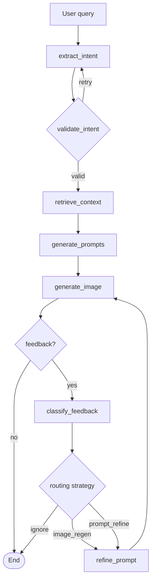

# VizzyChat

VizzyChat is a chat-first image generation workflow. A natural-language request is turned into an intent, the intent is validated, supporting context is gathered, a generation prompt is prepared, and an image is created. The same session can then accept feedback and regenerate the image from the last generated image plus the feedback, without rewriting the prompt or repeating the entire workflow.

The feedback loop uses a hybrid strategy: local visual tweaks default to image-conditioned regeneration, while broader semantic changes can route through prompt refinement. This keeps the common edit path stable while still allowing larger request changes when needed.

The repository contains two parts:

- a FastAPI backend that orchestrates the workflow and serves generated images
- a React + Vite frontend that presents the workflow as a threaded chat UI

## Project Overview

The typical flow looks like this:

1. The user enters a query such as a scene description or creative brief.
2. The backend extracts intent and validates it through a LangGraph workflow.
3. The backend retrieves context, builds a prompt, and sends it to the image generation step.
4. The frontend renders the parsed intent, prepared prompt, and resulting image as chat bubbles.
5. The user can send feedback in the same thread to regenerate from the last image while keeping the original prompt intact.

The implementation is centered around these files:

- [backend/app.py](backend/app.py) for the HTTP API, CORS, session storage, and image serving
- [backend/graph.py](backend/graph.py) for the LangGraph workflow and regeneration routing
- [backend/main.py](backend/main.py) for the public workflow helper functions
- [backend/utils/schema.py](backend/utils/schema.py) for request, response, and state models
- [frontend/src/App.tsx](frontend/src/App.tsx) for the chat UI and session/thread behavior
- [frontend/src/api.ts](frontend/src/api.ts) for the browser API client

## Repository Layout

```text
backend/
	app.py              FastAPI app and workflow endpoints
	graph.py            LangGraph workflow definition
	image.py            Image generation and feedback-driven regeneration
	intent.py           Intent extraction
	main.py             Workflow helper functions
	prompt_generator.py Prompt creation from intent/context
	retrive_context.py  Context retrieval
	validate_intent.py  Intent validation and retry logic
	utils/
		config.py         Model and environment configuration
		prompts.py        Prompt templates
		schema.py         Pydantic models and shared state

frontend/
	src/
		App.tsx           Threaded chat UI
		api.ts            API wrapper
		main.tsx          React entry point
		styles.css        App styling
		types.ts          Frontend TypeScript types
	vite.config.ts      Dev server proxy configuration
```

## Backend Implementation

The backend is a FastAPI service that exposes the workflow as a small HTTP API. The app is defined in [backend/app.py](backend/app.py), which mounts the generated images directory, enables CORS, and keeps workflow sessions in memory.

The workflow itself is assembled in [backend/graph.py](backend/graph.py) using LangGraph. The current flow is:

`extract_intent` -> `validate_intent` -> `retrieve_context` -> `generate_prompts` -> `generate_image`



If regeneration is requested, the workflow can loop through:

`refine_prompt` -> `generate_image`

The public helpers in [backend/main.py](backend/main.py) are:

- `run_full_workflow(raw_query, image_data_url=None)` for the first generation pass
- `submit_feedback_and_regenerate(state, feedback_text)` for feedback-driven regeneration using the last image plus feedback
- `regenerate_without_feedback(state)` for alternative variations without feedback

### Backend responsibilities

- Intent extraction turns the raw query into a structured intent object.
- Intent extraction uses a ReAct-style retry loop when validation fails, so the agent can refine the intent before the workflow continues.
- Intent validation can retry extraction when the result is not usable.
- Context retrieval adds supporting information required by the prompt.
- Prompt generation converts the intent and context into a detailed generation prompt.
- Image generation sends the prepared prompt to the configured image service.
- Feedback regeneration preserves the original prompt, attaches the last image as the regeneration reference, and creates a new image while preserving the session.
- Feedback regeneration now classifies the feedback first and chooses between image regeneration and prompt refinement.
- The API serializes workflow state so the frontend can render the conversation thread.

### Backend API

The API surface exposed by [backend/app.py](backend/app.py) is:

- `GET /health` returns a simple health check.
- `POST /workflows/image-generation` starts a new workflow session.
- `POST /workflows/{session_id}/feedback` submits feedback for regeneration from the last image or requests a no-feedback regeneration.
- `GET /workflows/{session_id}` returns the current session state.
- `GET /images/*` serves generated images from the local images directory.

### Backend data models

The key request and response models are defined in [backend/utils/schema.py](backend/utils/schema.py):

- `WorkflowStartRequest` with `raw_query` and optional `image_data_url`
- `FeedbackRegenerationRequest` with optional `feedback_text`
- `WorkflowSessionResponse` with `session_id`, image URL, regeneration count, and full workflow state
- `SharedState`, which stores the workflow state while it moves through the graph

### Backend configuration

The backend reads environment variables from the process environment. The important ones are:

- `OPENAI_API_KEY` for the default LLM path
- `GEMINI_API_KEY` for the Gemini model option
- `OPENROUTER_API_KEY` for the OpenRouter model option
- `CLOUDFLARE_API_KEY` for image generation
- `CLOUDFLARE_WORKER_URL` for the image generation endpoint
- `FRONTEND_ORIGINS` for CORS configuration
- `ENABLE_FEEDBACK_CLASSIFICATION` to enable the classifier-assisted routing path
- `CLASSIFIER_TIMEOUT_SECONDS` and `CLASSIFIER_CONFIDENCE_THRESHOLD` for classifier guardrails

The default CORS origins are `http://localhost:5173` and `http://127.0.0.1:5173`.

The model configuration is centralized in [backend/utils/config.py](backend/utils/config.py).

### Backend limitations

- Sessions are stored in memory, so they are lost when the backend restarts.
- The image and LLM steps depend on external services and valid API keys.
- The workflow is designed for local development and experimentation, not durable production storage.
- The repository includes a file named [backend/retrive_context.py](backend/retrive_context.py); the spelling matches the current codebase.
- The feedback router currently uses a deterministic rule-based baseline with an optional LLM-assisted path behind a feature flag.

## Frontend Implementation

The frontend is a React 18 + TypeScript app built with Vite. It renders the workflow as a chat thread so the user can see the evolving state of the generation session.

The main application lives in [frontend/src/App.tsx](frontend/src/App.tsx). It manages:

- chat threads for separate workflow sessions
- a draft session for starting a new generation
- the React chat loop that captures the user message and triggers intent extraction in the backend
- feedback mode for continuing the active thread without changing the original prompt
- message bubbles for user queries, parsed intent, prepared prompts, and image results

The browser API wrapper in [frontend/src/api.ts](frontend/src/api.ts) calls the backend endpoints and defaults to `http://127.0.0.1:8000` unless `VITE_API_BASE_URL` is set.

The frontend expects these backend routes to be available:

- `/workflows/image-generation`
- `/workflows/{session_id}/feedback`
- `/images/*`
- `/health`

### Frontend behavior

- Starting a new session sends a raw query to the backend and creates a new thread tab.
- Once a session exists, the composer switches into feedback mode for the active thread.
- The app renders the parsed intent as an intent bubble, the original generation prompt as a prompt bubble, and the image as an image bubble.
- Feedback regeneration keeps the prompt bubble as the original prompt and regenerates from the prior image plus the feedback message.
- Feedback regeneration may route to prompt refinement when the feedback is semantic or global rather than a local visual edit.
- The image bubble includes a download action that fetches the served image and saves it locally.

### Frontend build and dev setup

The Vite dev server is configured in [frontend/vite.config.ts](frontend/vite.config.ts):

- dev server host: `0.0.0.0`
- dev server port: `5173`
- preview host: `0.0.0.0`
- preview port: `4173`
- proxy targets: backend API and image routes at `http://127.0.0.1:8000`

## Local Setup

### Prerequisites

- Python 3.11 or newer
- Node.js 18 or newer
- A `.venv` or equivalent Python environment with the backend dependencies installed
- The required API keys for the backend services

### 1. Clone and open the repository

```bash
git clone <repo-url>
cd VizzyChat
```

### 2. Set backend environment variables

Create a `.env` file at the repository root or export the variables in your shell:

```env
OPENAI_API_KEY=your-openai-key
GEMINI_API_KEY=your-gemini-key
OPENROUTER_API_KEY=your-openrouter-key
CLOUDFLARE_API_KEY=your-cloudflare-key
CLOUDFLARE_WORKER_URL=https://your-worker-url.example
FRONTEND_ORIGINS=http://localhost:5173,http://127.0.0.1:5173
```

If you only use one model path, set the key for that provider and leave the others unset.

### 3. Install backend dependencies

The project is configured as a Python package in [pyproject.toml](pyproject.toml). Install the dependencies with your preferred Python environment manager. The repo has been used with `uv`.

```bash
uv sync
```

If you are using an existing virtual environment instead, install from the project metadata with your normal workflow.

### 4. Start the backend

```bash
uv run uvicorn backend.app:app --host 127.0.0.1 --port 8000 --reload
```

You can also run the module directly:

```bash
uv run python backend/app.py
```

### 5. Install frontend dependencies

```bash
cd frontend
npm install
```

### 6. Start the frontend

```bash
npm run dev
```

Open the Vite server at `http://localhost:5173`.

### 7. Optional production preview

```bash
npm run build
npm run preview
```

## Usage

1. Start the backend on port 8000.
2. Start the frontend on port 5173.
3. Open the frontend in your browser.
4. Enter an image description or creative brief in the composer.
5. Review the parsed intent, prompt, and generated image.
6. Add feedback in the active thread to regenerate the image from the last image while keeping the original prompt intact.
7. Use the thread tabs to switch between sessions.

## API Examples

### Start a new workflow

```bash
curl -X POST http://127.0.0.1:8000/workflows/image-generation \
	-H "Content-Type: application/json" \
	-d '{"raw_query":"A cinematic fox scientist building a glowing machine in a rain-soaked lab"}'
```

### Send feedback to an existing session

```bash
curl -X POST http://127.0.0.1:8000/workflows/<session-id>/feedback \
	-H "Content-Type: application/json" \
	-d '{"feedback_text":"Make it warmer and add more color contrast"}'
```

### Read session state

```bash
curl http://127.0.0.1:8000/workflows/<session-id>
```

## Verification

Run the backend tests:

```bash
python test_api.py
python test_feedback_loop.py
```

Run the frontend build check:

```bash
cd frontend
npm run build
```

These checks validate the API surface, the feedback loop behavior, and the frontend TypeScript build.

## Feedback Loop Behavior

When you submit feedback for an existing session:

1. The backend classifies the feedback as either a local edit or a broader semantic change.
2. Local edit feedback uses the last generated image together with the feedback text for image-conditioned regeneration.
3. Semantic or style-shift feedback can route through prompt refinement before the next image generation step.
4. The session updates with the new image while keeping the same thread history and regeneration metadata.

The no-feedback regeneration path still exists for alternate variations, and the feature flag `ENABLE_FEEDBACK_CLASSIFICATION=false` restores the original image-regeneration-first behavior.

### Feedback Routing Rules

- Local visual edits such as brightness, contrast, color, lighting, or small composition changes default to image regeneration.
- Broader changes such as mood shifts, style changes, or prompt overrides default to prompt refinement.
- Unknown or low-confidence feedback falls back to image regeneration.
- The selected route is stored in the session state for traceability.

## Notes

- The workflow state is intentionally session-based and in-memory for now.
- Generated images are served from the local `images/` directory.
- The existing quick-start and feedback-loop docs remain useful for deeper background, but this README is the main entry point for the project.
- The backend tests now cover both routing strategies and the feedback bookkeeping path.
